<div align="center">

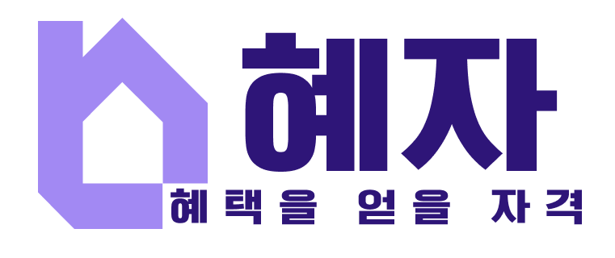

# 혜자 (HYEJA) · Frontend

**혜**택 + **자**격 — 내 조건에 맞는 청년 주거 정책을, 받을 수 있는지와 그 이유까지 알려주는 서비스

LG CNS AM Inspire 6기 미니프로젝트 1 · 7조 **혜자본주의**

<table align="center">
  <tr><th>Frontend</th><th>Frontend</th><th>Backend</th><th>Backend</th><th>Backend</th></tr>
  <tr><td align="center"><a href="https://github.com/kimrim818-afk"></a></td><td align="center"><a href="https://github.com/eom-tae-in"></a></td><td align="center"><a href="https://github.com/yhi9839"></a></td><td align="center"><a href="https://github.com/GREED-YI"></a></td><td align="center"><a href="https://github.com/ljw2869"></a></td></tr>
  <tr><td align="center"><a href="https://github.com/kimrim818-afk">@kimrim818-afk</a></td><td align="center"><a href="https://github.com/eom-tae-in">@eom-tae-in</a></td><td align="center"><a href="https://github.com/yhi9839">@yhi9839</a></td><td align="center"><a href="https://github.com/GREED-YI">@GREED-YI</a></td><td align="center"><a href="https://github.com/ljw2869">@ljw2869</a></td></tr>
</table>

[](https://github.com/Hyejabonjuui/frontend)
[](https://github.com/Hyejabonjuui/backend)

</div>

<br>

## 목차

1. [프로젝트 소개](#-프로젝트-소개)
2. [주요 화면](#-주요-화면)
3. [핵심 기능](#-핵심-기능)
4. [기술 스택](#-기술-스택)
5. [프론트엔드 아키텍처](#-프론트엔드-아키텍처)
6. [화면 흐름](#-화면-흐름)
7. [폴더 구조](#-폴더-구조)
8. [실행 방법](#-실행-방법)
9. [테스트](#-테스트)
10. [협업 방식](#-협업-방식)

<br>

## 📌 프로젝트 소개

청년 주거 정책은 기관마다 흩어져 있고, 자격 조건과 용어가 어려워 내가 받을 수 있는지 판단하기 어렵습니다.
**혜자**는 나이 · 거주지 · 취업 상태 같은 조건을 **한 번만 등록**하면, 검색창에 필요한 것만 말해도("월세 지원 알려줘") 받을 수 있는 주거 정책을 찾아 줍니다.

이 저장소는 혜자의 **React SPA**입니다. 화면에서 신경 쓴 것은 네 가지입니다.

- **판정 결과를 이유와 함께** — 결과를 `받을 수 있어요` / `확인이 필요해요` / `아쉽게 안 돼요` 세 그룹으로 나누고, 조건마다 ✓ · ✗ · ? 기호와 쉬운 말로 된 이유를 붙입니다. 색만으로 구분하지 않습니다.
- **흐름이 끊기지 않는 로그인** — 비로그인 상태에서 ♡를 누르면 로그인 모달이 뜨고, 로그인하면 누르려던 저장을 그대로 이어서 실행합니다.
- **AI 호출 아끼기** — 맞춤 검색은 요청마다 서버가 OpenAI를 부릅니다. 뒤로 · 앞으로 가기로 돌아온 검색은 저장해 둔 결과를 씁니다.
- **백엔드 없이도 전체 화면 확인** — 목 모드를 켜면 axios 어댑터가 앱 안의 가짜 백엔드로 바뀌어, 로그인부터 관리자 수집까지 그대로 돌아갑니다.

<br>

## 🖥 주요 화면

<table>
  <tr>
    <td width="50%">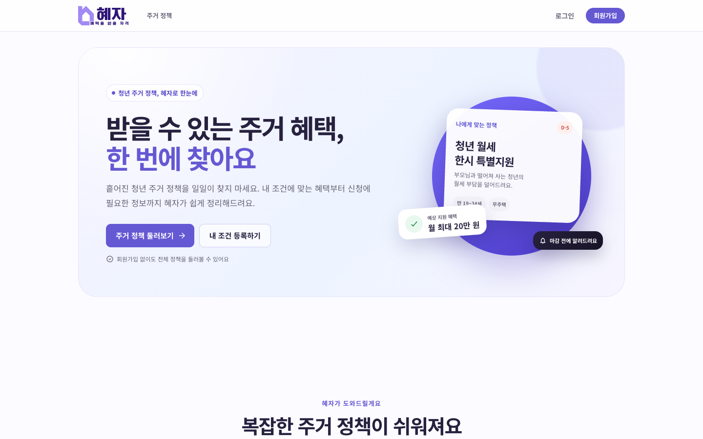</td>
    <td width="50%">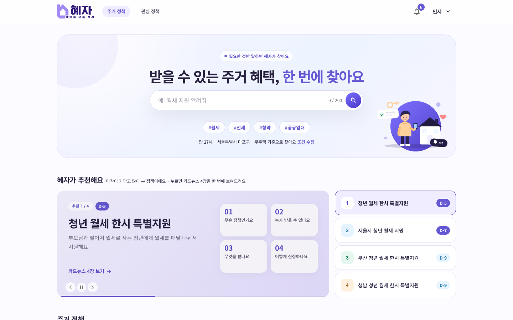</td>
  </tr>
  <tr>
    <td align="center"><b>랜딩</b> · 서비스 소개와 사용법 3단계</td>
    <td align="center"><b>홈</b> · 카드뉴스 추천과 주거 정책 목록</td>
  </tr>
  <tr>
    <td width="50%">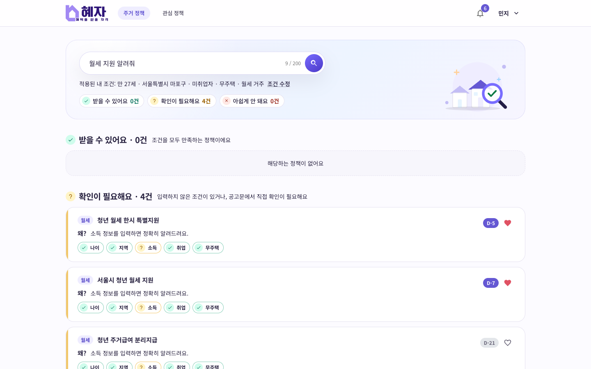</td>
    <td width="50%">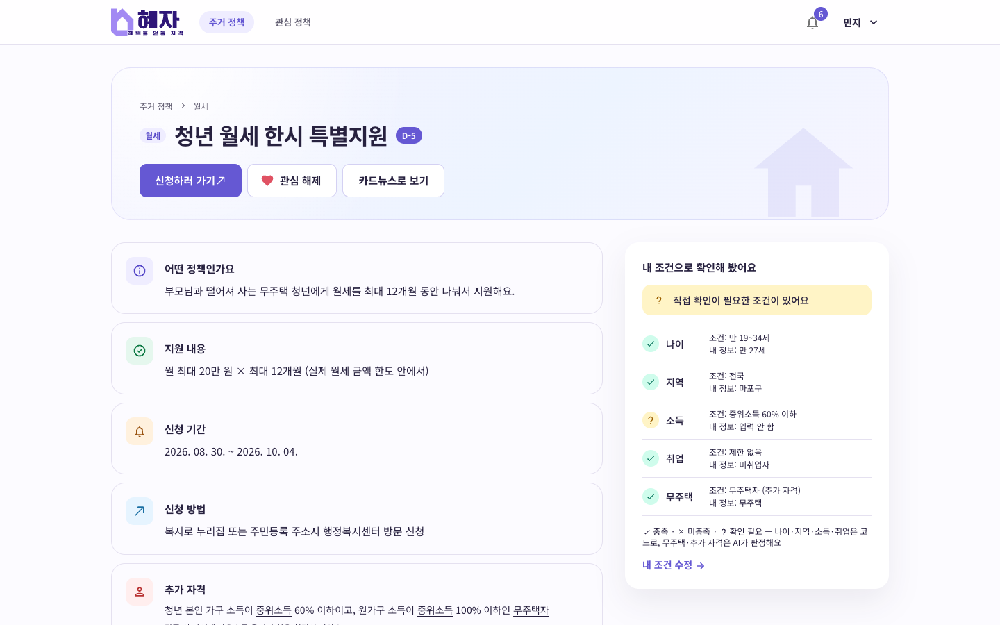</td>
  </tr>
  <tr>
    <td align="center"><b>맞춤 검색</b> · 3그룹 결과와 조건별 판정 · 이유</td>
    <td align="center"><b>정책 상세</b> · 내 조건으로 본 판정과 용어 풀이</td>
  </tr>
  <tr>
    <td width="50%">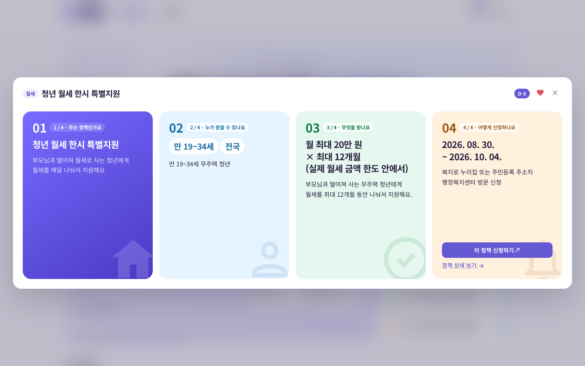</td>
    <td width="50%">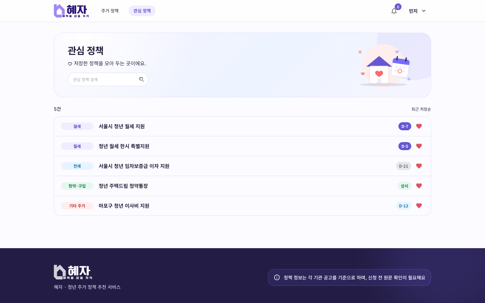</td>
  </tr>
  <tr>
    <td align="center"><b>카드뉴스</b> · 정책 하나를 4장으로 요약</td>
    <td align="center"><b>관심 정책</b> · 저장한 정책 검색과 마감 D-day</td>
  </tr>
</table>

> 스크린샷은 [목 모드](docs/mock-mode.md)의 테스트 계정으로 찍었습니다. 정책과 판정은 더미 데이터입니다.

<br>

## ✨ 핵심 기능

| 기능                | 설명                                                                                                           | 경로                       |
| ------------------- | -------------------------------------------------------------------------------------------------------------- | -------------------------- |
| 회원가입 · 로그인   | 이메일 인증 코드(6자리 · 60초 뒤 재발송)를 확인하고 계정과 조건을 한 번에 가입. 가입하면 바로 로그인           | `/signup` · 로그인 모달    |
| 내 조건 등록 · 수정 | 생년월일 · 거주지 · 취업 · 무주택은 필수, 혼인 · 소득 · 학력 · 주거 형태는 선택. 입력 중 이탈하면 임시 저장    | `/conditions` · 마이페이지 |
| 주거 정책 목록      | 유형 탭(월세 · 전세 · 청약 · 공공임대 · 기타), 마감 임박순 · 조회순, 로그인하면 "나에게 맞는 것만"             | `/home`                    |
| **AI 맞춤 검색**    | 결과를 3그룹으로 나누고 조건별 ✓ · ✗ · ? 칩과 AI가 쓴 이유를 표시. `#월세` 같은 해시태그 검색                  | `/search?query=`           |
| 정책 상세           | 로그인하면 조건별 판정 표, 어려운 용어에 쉬운 설명, 카드뉴스 · 신청 링크 · 관심 저장                           | `/policies/:policyId`      |
| 카드뉴스            | 정책 하나를 "무슨 정책 · 누가 · 무엇을 · 어떻게" 4장으로 요약. 홈 배너는 5초마다 넘어가고 마우스를 올리면 멈춤 | 홈 · 정책 상세             |
| 관심 정책           | ♡ 저장 · 해제, 관심 목록 안에서 키워드 검색, 번호 페이지네이션                                                 | `/favorites`               |
| 마감 알림           | 관심 정책 마감 D-7 알림. 헤더에는 안 읽은 알림만, 마이페이지에는 전체 목록 · 읽음 · 삭제                       | 헤더 · 마이페이지          |
| 계정                | 계정 정보, 비밀번호를 확인한 뒤 회원 탈퇴(조건 · 관심 · 알림 함께 삭제), 닉네임 · 생년월일로 이메일 찾기       | 마이페이지 · `/find-email` |
| 관리자              | 온통청년 정책 수집 실행. 중간에 멈추면 멈춘 페이지와 저장 건수를 표시                                          | `/admin`                   |

<br>

## 🛠 기술 스택


| 구분          | 사용 기술                                                        |
| ------------- | ---------------------------------------------------------------- |
| Framework     | React 19, react-router-dom 7 (lazy 라우트), Vite 8               |
| UI            | MUI 9, Emotion — 디자인 토큰은 `src/styles/theme.js` 한 곳       |
| HTTP          | axios — 인스턴스 하나에 토큰 첨부 · 401 처리 인터셉터            |
| State         | React Context (로그인 · 알림 · 토스트 · 로그인 모달) + 커스텀 훅 |
| Test          | Vitest, Testing Library, MSW, Playwright (Chromium)              |
| Lint · Format | ESLint (react-hooks · react-refresh), Prettier                   |
| Runtime       | Node 24 이상 (`.nvmrc`)                                          |

### Tools


<br>

## 🏗 프론트엔드 아키텍처

### 전체 구조

<picture>
  <source media="(prefers-color-scheme: dark)" srcset="docs/images/architecture/architecture-overview-dark.png">
  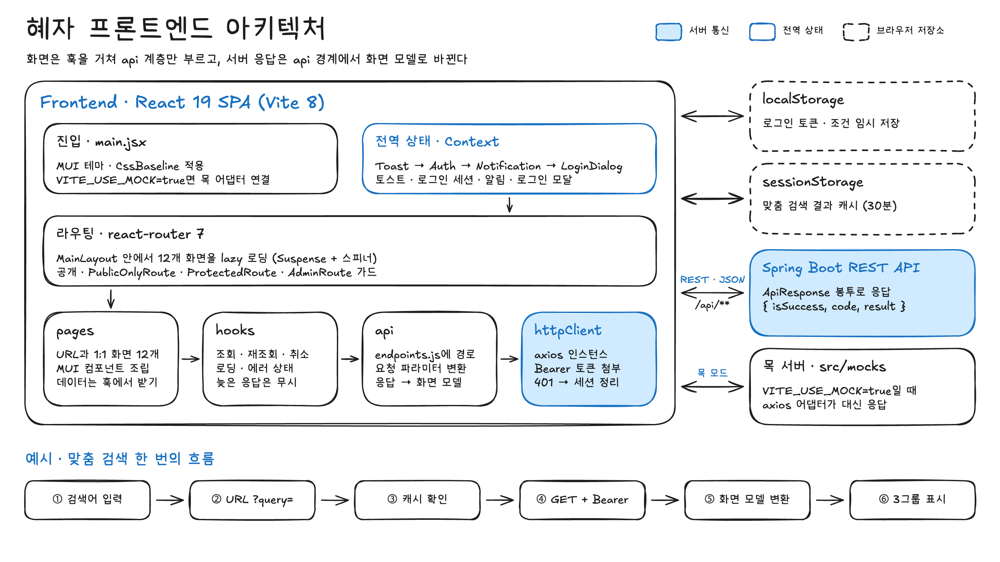
</picture>

- 화면은 `pages → hooks → api → httpClient` 한 방향으로만 내려갑니다. 컴포넌트는 axios를 직접 부르지 않습니다.
- 12개 화면은 모두 lazy 로딩하고, `MainLayout` 안에서 라우트 그룹마다 가드 하나를 둡니다.

### 로그인 · 라우트 가드

<picture>
  <source media="(prefers-color-scheme: dark)" srcset="docs/images/architecture/architecture-auth-routing-dark.png">
  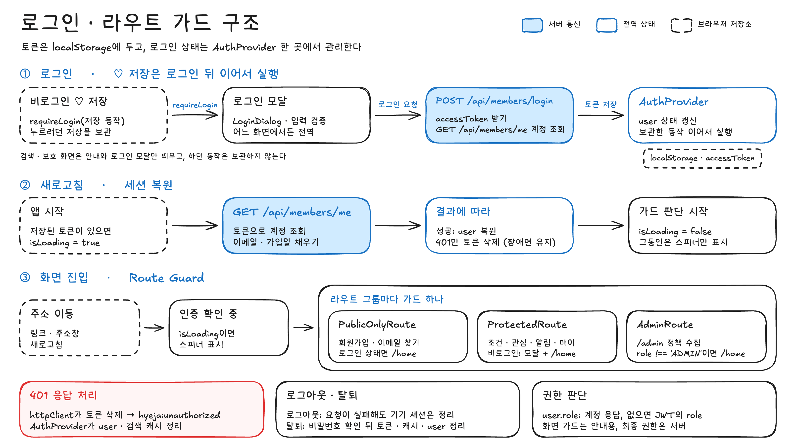
</picture>

- 토큰은 `localStorage`에 두고, 로그인 상태는 `AuthProvider` 한 곳에서 관리합니다. 새로고침하면 `/members/me`로 세션을 복원합니다.
- 401 응답은 `httpClient`가 한 번에 처리합니다. 토큰을 지우고 이벤트를 보내면 `AuthProvider`가 화면 상태와 검색 캐시를 정리합니다.

### API 연동 · 목 모드

<picture>
  <source media="(prefers-color-scheme: dark)" srcset="docs/images/architecture/architecture-api-mock-dark.png">
  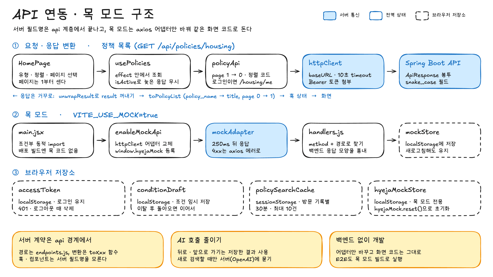
</picture>

- 백엔드 응답 봉투와 snake_case 필드는 api 계층의 `toXxx` 함수에서 화면 모델로 바뀝니다. → [`docs/api-integration.md`](docs/api-integration.md)
- 목 모드는 axios 어댑터만 바꾸므로 화면 코드는 실서버일 때와 같습니다. 배포 빌드에는 목 코드가 들어가지 않습니다. → [`docs/mock-mode.md`](docs/mock-mode.md)

<br>

## 🧭 화면 흐름

<picture>
  <source media="(prefers-color-scheme: dark)" srcset="docs/images/screen-flow/screen-flow-dark.png">
  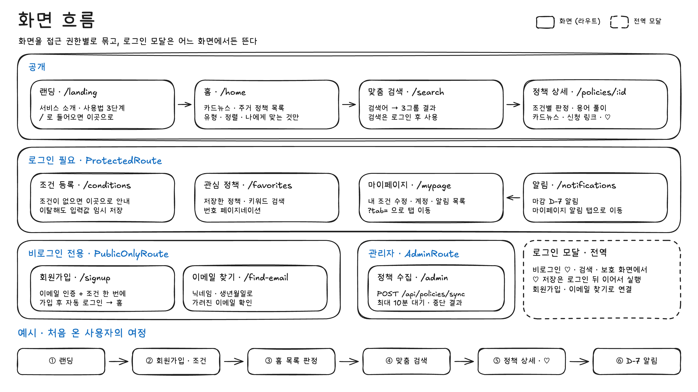
</picture>

| 설계서 | 화면           | 경로                                           | 접근                 |
| ------ | -------------- | ---------------------------------------------- | -------------------- |
| -      | 랜딩           | `/landing` (`/`로 들어오면 이동)               | 공개                 |
| S-01   | 홈             | `/home`                                        | 공개                 |
| S-02   | 로그인         | 모달 (전역)                                    | 비로그인             |
| S-03   | 회원가입       | `/signup`                                      | 비로그인 전용        |
| S-04   | 내 조건 등록   | `/conditions`                                  | 로그인               |
| S-05   | 맞춤 검색 결과 | `/search?query=`                               | 공개 (검색은 로그인) |
| S-06   | 정책 상세      | `/policies/:policyId`                          | 공개                 |
| S-08   | 마이페이지     | `/mypage?tab=condition\|account\|notification` | 로그인               |
| S-09   | 알림함         | `/notifications` → 마이페이지 알림 탭          | 로그인               |
| S-10   | 정책 관리      | `/admin`                                       | 관리자               |
| S-14   | 관심 정책      | `/favorites`                                   | 로그인               |
| S-15   | 이메일 찾기    | `/find-email`                                  | 비로그인 전용        |

<br>

## 📁 폴더 구조

```text
src
├── api                           # axios 인스턴스(httpClient) · 경로(endpoints) · 도메인별 API와 응답 변환
├── components                    # 재사용 컴포넌트 (폴더마다 Name.jsx + index.js)
│   ├── auth                      # 로그인 모달 · 로그인 안내 모달
│   ├── common                    # 아이콘 · 그림 · D-day 배지 · 판정 칩/아이콘 · 빈/오류 상태 · 페이지네이션
│   │                             #   · 화면 머리 영역(PageHero) · 폼 화면 틀 · 비밀번호 입력칸
│   ├── landing                   # 랜딩 히어로
│   ├── layout                    # Header · Footer · MainLayout
│   ├── notification              # 알림 항목 · 목록 · 헤더 팝오버
│   ├── policy                    # 정책 목록 · 검색창 · 유형 탭 · 카드뉴스 · 용어 풀이
│   └── search                    # 맞춤 검색 결과 3그룹 · 카드 · 스켈레톤
├── constants                     # 라우트 · 메시지 · 정책/조건 선택지 · 저장소 키
├── contexts                      # 로그인 · 로그인 모달 · 알림 · 토스트 전역 상태
├── hooks                         # 정책 · 검색 · 관심 · 알림 · 조건 조회와 재사용 로직
├── mocks                         # 목 모드 가짜 백엔드 (어댑터 · 핸들러 · 저장소 · 더미 데이터)
├── pages                         # 화면 단위 (landing · home · search · policy · favorite ·
│                                 #   notification · mypage · onboarding · auth · admin)
├── routes                        # Router · PublicOnly/Protected/Admin 라우트 가드
├── styles                        # MUI 테마(디자인 토큰 단일 소스) · 전역 CSS
└── utils                         # 날짜 · 토큰 저장 · 검색 캐시 · 조건 임시 저장 · 에러 문구
public
├── icons                         # 화면 아이콘 SVG (AppIcon의 name으로 사용)
└── illustrations                 # 머리 영역 · 빈 상태 장식 그림 (Illustration의 name으로 사용)
tests
├── unit                          # Vitest 단위 테스트 (src 경로를 그대로 따름)
├── integration                   # Testing Library + MSW 화면 통합 테스트
├── e2e                           # Playwright 사용자 여정 테스트
└── msw                           # 통합 테스트용 핸들러 · 응답 fixture
docs
├── images                        # 로고 · 아키텍처 · 화면 흐름 · 스크린샷
├── diagrams                      # 다이어그램 원본 (.excalidraw)
└── *.md                          # API 연동 · 목 모드 · 코드 작성 규칙
```

<br>

## 🚀 실행 방법

### 사전 준비

- Node.js 24 이상 (`.nvmrc` — nvm을 쓰면 `nvm use`)
- 실서버에 붙일 때는 백엔드 서버 ([backend 저장소](https://github.com/Hyejabonjuui/backend) 참고). 백엔드 없이 보려면 목 모드를 씁니다.

### 1. 설치

```bash
npm install
```

### 2. 환경 변수

`.env.example`을 복사해 `.env.development`(로컬 전용, Git에 올리지 않음)를 만듭니다.

| 변수                | 설명                                | 예시                    |
| ------------------- | ----------------------------------- | ----------------------- |
| `VITE_API_BASE_URL` | 백엔드 API 주소                     | `http://localhost:8080` |
| `VITE_USE_MOCK`     | `true`면 목 모드 (백엔드 없이 실행) | `true` / `false`        |

배포 빌드는 `.env.production`의 `VITE_USE_MOCK=false`를 씁니다. 배포할 때는 `VITE_API_BASE_URL`을 배포된 API 주소로 지정합니다.

### 3. 실행

```bash
npm run dev       # 개발 서버 → http://localhost:5173
npm run build     # 프로덕션 빌드 → dist/
npm run preview   # 빌드 결과 미리 보기
```

| 스크립트               | 하는 일                           |
| ---------------------- | --------------------------------- |
| `npm run lint`         | ESLint 검사 (`lint:fix`로 고치기) |
| `npm run format`       | Prettier로 전체 포맷              |
| `npm run format:check` | Prettier 검사 (CI와 같음)         |

### 백엔드 없이 실행 (목 모드)

`VITE_USE_MOCK=true`로 두고 `npm run dev`를 실행한 뒤 아래 계정으로 로그인합니다.

| 계정             | 비밀번호     | 역할                                              |
| ---------------- | ------------ | ------------------------------------------------- |
| `minji@hyeja.kr` | `hyeja1234!` | 일반 회원 (조건 · 관심 정책 · 알림이 채워져 있음) |
| `admin@hyeja.kr` | `hyeja1234!` | 관리자 (정책 수집 화면 접근)                      |

초기화는 브라우저 콘솔에서 `window.hyejaMock.reset()`을 실행합니다.
특수 검색어(`후보0건` · `주거아님`)와 동작 원리는 [`docs/mock-mode.md`](docs/mock-mode.md)에 있습니다.

<br>

## 🧪 테스트

```bash
npm test                          # Vitest watch (단위 + 통합)
npm run test:unit                 # 단위 테스트
npm run test:integration          # 통합 테스트 (MSW)
npm run test:coverage             # 단위 + 통합 커버리지 → coverage/index.html
npx playwright install chromium   # E2E 브라우저 (처음 한 번)
npm run test:e2e                  # E2E (목 모드로 빌드한 뒤 실행)
```

<picture>
  <source media="(prefers-color-scheme: dark)" srcset="docs/images/architecture/architecture-test-ci-dark.png">
  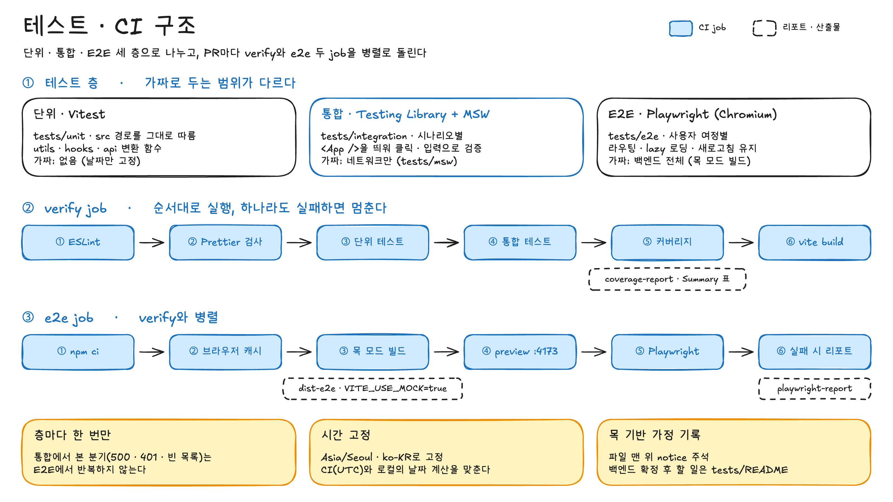
</picture>

| 층   | 위치                 | 도구                                  | 가짜로 두는 것                             |
| ---- | -------------------- | ------------------------------------- | ------------------------------------------ |
| 단위 | `tests/unit/`        | Vitest                                | 없음 (날짜만 고정)                         |
| 통합 | `tests/integration/` | Vitest + Testing Library + user-event | 네트워크만 (MSW, `tests/msw/`)             |
| E2E  | `tests/e2e/`         | Playwright (Chromium)                 | 백엔드 전체 (앱 내장 목 서버, `src/mocks`) |

- 세 층 모두 **실제 백엔드 없이** 돕니다. 무엇이 가정인지와 백엔드 확정 후 바꿀 곳은 [`tests/README.md`](tests/README.md)에 있습니다.
- PR을 올리면 GitHub Actions가 `verify`(lint → format → 단위 → 통합 → 커버리지 → build)와 `e2e`를 병렬로 실행합니다. → [`.github/workflows/ci.yml`](.github/workflows/ci.yml)
- 커버리지 리포트는 `verify` 실행의 Summary와 `coverage-report` artifact에서 봅니다.

<br>

## 🤝 협업 방식

### 작업 흐름

```text
이슈 생성 → 이슈 브랜치 생성 → 개발 · 커밋 → git pull origin main → push → PR → 리뷰 · CI 통과 → squash merge
```

1. 모든 작업은 **이슈**부터 만듭니다. ([이슈 템플릿](.github/ISSUE_TEMPLATE/작업-이슈.md))
2. **1이슈 1브랜치**로 작업합니다.
3. push 전에 `git pull origin main`으로 최신 main을 반영합니다.
4. `main` 대상으로 PR을 올리고 이슈를 연결합니다(`Closes #번호`). ([PR 템플릿](.github/pull_request_template.md))
5. CI(`verify` · `e2e`) 통과와 리뷰 후 **squash merge**합니다. main 이력에는 PR 제목이 남습니다.

### 컨벤션

| 구분      | 형식                           | 예시                                          |
| --------- | ------------------------------ | --------------------------------------------- |
| 이슈 · PR | `[태그] 구현 내용 요약`        | `[fix] 관심 정책 상세 이동 후 목록 상태 복원` |
| 브랜치    | `태그/이슈번호/구현내용(영어)` | `fix/11/policy-detail-raw-conditions`         |
| 커밋      | `태그: 변경 내용`              | `docs: 프론트엔드 README 개편`                |

| 태그       | 사용하는 경우                  |
| ---------- | ------------------------------ |
| `feat`     | 새로운 기능 추가               |
| `fix`      | 버그 수정                      |
| `refactor` | 동작 변경 없이 구조 개선       |
| `docs`     | 문서 추가 · 수정               |
| `test`     | 테스트 코드                    |
| `style`    | 정렬 · 공백 등 형식            |
| `chore`    | 환경 설정 · 의존성 · 협업 도구 |

코드 작성 규칙(폴더 책임 · 데이터 조회 패턴 · 스타일 토큰 · 화면 규칙)은 [`docs/conventions.md`](docs/conventions.md)를 참고합니다.
